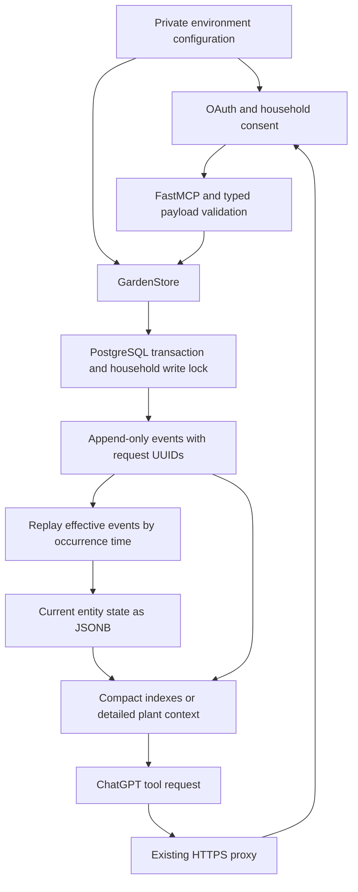

# Data flow

`server.py` registers nine tools and OAuth routes. `models.py` validates reported facts.
`store.py` uses a five-connection async pool. One transaction checks retry identity, validates
references, inserts an event, replays that entity and updates its projection. A single
transaction advisory lock serializes household writes. Reads do not acquire that lock.
Detailed context uses a repeatable-read snapshot to keep state and history consistent.

Entities have immutable UUIDs and a kind: plant, location or inventory. Event ordering is
`occurred_at, sequence`; plant/location creation supplies baseline state before later patches,
even when a reported event predates registration. Correction chains suppress all superseded
records. Recent history includes `is_effective`; latest actions use effective facts only.
History is bounded to 20 by default and 100 maximum, but latest care actions cover all history.

`auth.py` delegates OAuth/PKCE protocol validation to the MCP SDK and persists OAuth records
in the same database. Access tokens last one hour; refresh tokens rotate and last 30 days.
Household password hashes use salted scrypt. Opaque tokens and authorization codes are stored
by SHA-256 lookup hashes; OAuth client secrets remain private database records for SDK validation.
